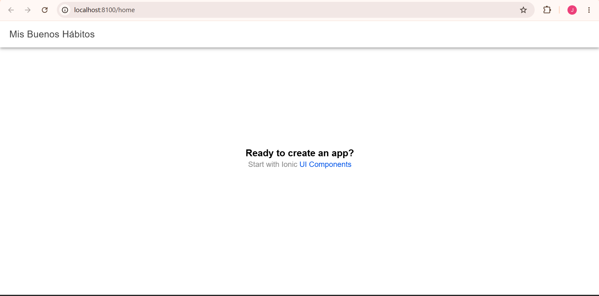

# Semana 06 - Primer proyecto Ionic React

## Nombre
Julio Cesar Lozano Lozano

## Descripción

En esta actividad se configuró el entorno de desarrollo para crear una aplicación móvil utilizando Ionic React.

## 1. Instalación de Node.js

Se instaló Node.js en su versión LTS para poder trabajar con las herramientas necesarias para el proyecto.

Se verificó la instalación con:

```bash
node -v
npm -v
```

## 2. Instalación de Ionic CLI

Se instaló Ionic CLI mediante el siguiente comando:

```bash
npm install -g @ionic/cli
```

Se verificó la instalación con:

```bash
ionic -v
```

## 3. Creación del proyecto

Se creó el proyecto Ionic React utilizando:

```bash
ionic start miApp blank --type=react
```

El proyecto fue creado dentro de la carpeta:

```text
06-week/miApp
```

## 4. Ejecución del proyecto

Para ejecutar la aplicación se utilizó:

```bash
ionic serve
```

La aplicación se ejecutó correctamente en:

```text
http://localhost:8100
```

## 5. Modificación de la pantalla inicial

Se modificó el título de la pantalla inicial en el archivo:

```text
src/pages/Home.tsx
```

El título original `Blank` fue cambiado por:

**Mis Buenos Hábitos**

## 6. Evidencia

La siguiente captura muestra el proyecto Ionic React ejecutándose correctamente y con el título modificado:



## Conclusión

Se logró configurar el entorno de desarrollo, instalar Ionic CLI, crear un proyecto Ionic React y ejecutarlo correctamente. También se modificó el título de la pantalla inicial y se dejó evidencia del resultado.
